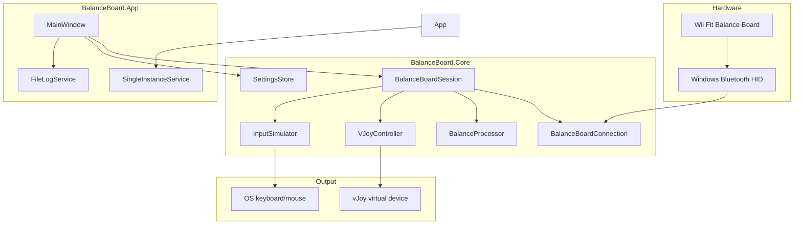

# Architecture

## High-level diagram



## Poll loop

`BalanceBoardSession` uses a `System.Timers.Timer` at **50 ms** (20 Hz):

1. `BalanceBoardConnection.GetCurrentReading()` → `BalanceReading`
2. `BalanceProcessor.Process(reading, settings)` → `ProcessedBalance`
3. Raise `Processed` event (UI updates)
4. If `EnableVJoy` && `VJoyController.IsReady` → `VJoyController.Update(processed)`
5. If `!DisableKeyboardActions` → `InputSimulator.Apply(processed, settings)`

No duplicate event subscription on `ReadingReceived` — polling only.

## Processing pipeline

`BalanceProcessor` (ported from WiiBalanceWalker logic):

1. **Tare** — tracks per-corner minimum (auto zero)
2. **Center offset** — optional user-defined standing position
3. **Balance %** — X/Y from corner weight distribution
4. **Deadzone / sensitivity / invert** — from `AppSettings`
5. **Movement triggers** — compare balance % to thresholds:
   - `TriggerLeftRight` (default 8%)
   - `TriggerForwardBackward` (default 9%)
   - `TriggerModifierLeftRight` (15%)
   - `TriggerModifierForwardBackward` (16%)
6. **Jump** — rapid weight change detection
7. **vJoy axes** — map COG and/or load sensors per flags:
   - `SendCenterOfGravityToAxes` → X, Y
   - `SendLoadSensorsToAxes` → Z, RX, RY, RZ

Output: `ProcessedBalance` with booleans (`MoveLeft`, `Jump`, …) and `short` axis values.

## Preset system

`ActionPresets` mutates `AppSettings` in place:

| Preset | vJoy | Keyboard | Axis mapping |
|--------|------|----------|--------------|
| Game Controller | on | off | COG → X/Y |
| Pedal / Rudder | on | off | sensors → Z/RX/RY/RZ |
| Hand-Free Desktop | off | on | legacy WASD + Shift + Space + mouse X nudge |

`BalanceBoardSession.ApplyProfile(name)` calls preset + `LoadSettings`.

## Input simulation

`InputSimulator` holds per-action `RuntimeAction` state:

- **Key**: scan-code `SendInput` down on start, up on stop
- **MouseButton**: Left/Right/Middle/**X1**/**X2** (X buttons use `MOUSEEVENTF_XDOWN/UP`)
- **MouseMoveX/Y**: 2 ms timer repeating relative moves while active

Actions keyed by: `Left`, `Right`, `Forward`, `Backward`, `Modifier`, `Jump`, `DiagonalLeft`, `DiagonalRight`.

## vJoy lifecycle

```
Initialize(deviceId)
  → vJoyEnabled?
  → GetVJDStatus
  → if BUSY: FeederProcessCleanup + retry
  → AcquireVJD
Update(processed) each poll
Shutdown / Dispose
  → Center axes
  → RelinquishVJD
```

## Startup sequence (`App.xaml.cs`)

1. Single-instance mutex (`BalanceBoardApp_SingleInstance`)
2. `FeederProcessCleanup.TerminateCompetingFeeders()`
3. `WaitForVJoyDeviceFree(1)`
4. Create `MainWindow`, show
5. If `AutoConnectOnStartup` → `session.Connect()` on `Loaded`

## Threading notes

- WiimoteLib reads happen on timer thread
- UI updates via `Dispatcher.Invoke` in `MainWindow`
- `FileLogService` appends on caller thread; UI subscribes to `LineWritten`
- vJoy and SendInput are called from timer thread (same as legacy app)

## Extension points

| Extension | Suggested approach |
|-----------|-------------------|
| New preset | Add method in `ActionPresets`, name in `All`, wire UI |
| Custom action mapping UI | Edit `AppSettings.Actions`, reuse `InputSimulator` |
| Multi-device picker | `DiscoverDevices()` already returns IDs; add dialog before `Connect(index)` |
| Tray / minimized start | `AppSettings.StartMinimized`, notify icon in App |
| Game profiles | `SettingsStore.SaveProfile` / `LoadProfile` already exist; add UI |

See [ROADMAP.md](ROADMAP.md) for planned items.
