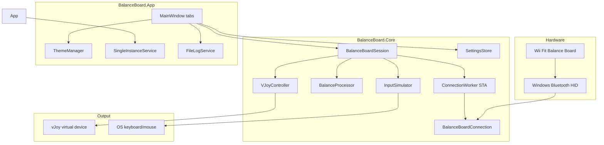

# Architecture

## High-level diagram



## Poll loop

`BalanceBoardSession` schedules a **50 ms** poll on `ConnectionWorker` (dedicated STA thread for WiimoteLib):

1. `_worker.Invoke` → `BalanceBoardConnection.GetCurrentReading()` → `BalanceReading`
2. `BalanceProcessor.Process(reading, settings)` → `ProcessedBalance`
3. Raise `Processed` event (UI updates via `Dispatcher.BeginInvoke`)
4. If `EnableVJoy` && `VJoyController.IsReady` → `VJoyController.Update(processed)` (axis coalescing skips unchanged values)
5. If `!DisableKeyboardActions` → `InputSimulator.Apply(processed, settings)`

All WiimoteLib / Bluetooth HID calls stay on `ConnectionWorker`. Do not add a second poll path.

## Processing pipeline

`BalanceProcessor` (ported from WiiBalanceWalker logic):

1. **Tare** — tracks per-corner minimum (auto zero)
2. **Center offset** — optional user-defined standing position
3. **Balance %** — X/Y from corner weight distribution (`BalanceDisplay` helper)
4. **Deadzone / sensitivity / invert** — from `AppSettings` or `SensitivityPresets`
5. **Movement triggers** — compare balance % to thresholds:
   - `TriggerLeftRight` (default 8%)
   - `TriggerForwardBackward` (default 9%)
   - `TriggerModifierLeftRight` (15%)
   - `TriggerModifierForwardBackward` (16%)
6. **Jump** — weight below `JumpWeightThresholdKg` for `JumpHoldSeconds` (`JumpPresets`: Easy / Normal / Hard)
7. **vJoy axes** — map COG and/or load sensors per flags:
   - `SendCenterOfGravityToAxes` → X, Y
   - `SendLoadSensorsToAxes` → Z, RX, RY, RZ

Output: `ProcessedBalance` with booleans (`MoveLeft`, `Jump`, …) and `short` axis values.

## Preset system

`ActionPresets` mutates `AppSettings` in place:

| Preset | vJoy | Keyboard | Axis mapping | Notes |
|--------|------|----------|--------------|-------|
| Game Controller | on | off | COG → X/Y | Default gaming |
| Minecraft (Controlify) | on | off | COG → X/Y | Button 1 = jump; Medium sensitivity |
| Pedal / Rudder | on | off | sensors → Z/RX/RY/RZ | Flight sim pedals |
| Hand-Free Desktop | off | on | WASD + Shift + mouse click jump | No vJoy |
| Balance Mouse | off | on | lean → cursor, jump → click | Desktop accessibility |

`BalanceBoardSession.ApplyProfile(name)` calls preset + `LoadSettings`.

## UI detail levels

`UiDetailLevel` (Simple / Standard / Advanced) controls progressive disclosure in `MainWindow`:

| Level | Tabs | Settings visible |
|-------|------|------------------|
| Simple | Dashboard + Profiles | Jump preset, sensitivity preset, profile buttons |
| Standard | + theme, calibration, invert on Profiles | |
| Advanced | + Advanced tab | Full sliders, vJoy, bindings, Debug Suite |

## Input simulation

`InputSimulator` holds per-action `RuntimeAction` state:

- **Key**: scan-code `SendInput` down on start, up on stop
- **MouseButton**: Left/Right/Middle/**X1**/**X2** (X buttons use `MOUSEEVENTF_XDOWN/UP`)
- **MouseMoveX/Y**: 2 ms timer repeating relative moves while active

Actions keyed by: `Left`, `Right`, `Forward`, `Backward`, `Modifier`, `Jump`, `DiagonalLeft`, `DiagonalRight`.

## vJoy lifecycle

```
Initialize(deviceId)
  → vJoyEnabled?
  → GetVJDStatus
  → if BUSY: FeederProcessCleanup + retry
  → AcquireVJD
Update(processed) each poll (coalesced writes)
Shutdown / Dispose
  → Center axes
  → RelinquishVJD
```

## Startup sequence (`App.xaml.cs`)

1. Single-instance mutex (`BalanceBoardApp_SingleInstance`) unless `--dev`
2. Show `MainWindow` immediately (settings loaded before `InitializeComponent`)
3. `RunDeferredStartup` on background: feeder cleanup, BT warmup, vJoy init
4. If `HasConnectedBefore` && `AutoConnectOnStartup` → `QuickReconnect` via `ConnectionWorker`

## Threading notes

- WiimoteLib and Bluetooth pairing run on `ConnectionWorker` STA thread only
- UI updates via `Dispatcher.BeginInvoke` in `MainWindow` (never block worker on `Invoke`)
- `FileLogService` appends on caller thread; UI subscribes to `LineWritten`
- vJoy and SendInput are called from the poll callback on `ConnectionWorker`

## Logging

Session log lines use structured prefixes for grep-friendly support:

| Tag | When |
|-----|------|
| `[CONNECT]` | Pairing, HID discovery, first reading |
| `[DISCONNECT]` | Teardown, callback drain |
| `[JUMP]` | Jump threshold crossed |
| `[VJOY]` | Acquire, relinquish, axis state |
| `[SETTINGS]` | Profile / detail level / preset changes |
| `[ERROR]` | Recoverable failures with context |

## Extension points

| Extension | Suggested approach |
|-----------|-------------------|
| New preset | Add method in `ActionPresets`, name in `All`, wire Profiles tab |
| Custom profile files | `SettingsStore.SaveProfile` / `LoadProfile` — add UI on Profiles tab |
| Multi-device picker | `DiscoverDevices()` returns IDs; modal before `Connect(index)` |
| Tray / minimized start | `AppSettings.StartMinimized`, notify icon in App |
| BT auto-reconnect | Session watchdog on `ConnectionWorker` with backoff |

See [ROADMAP.md](ROADMAP.md) for planned items.
