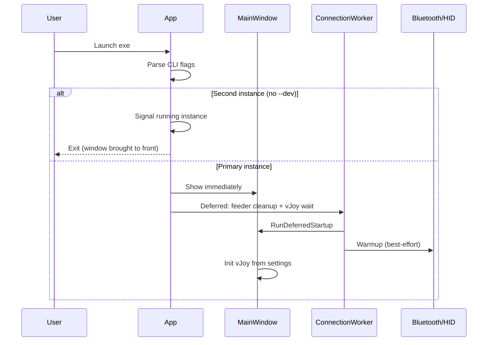

# Boot and connect workflow

This document describes how Balance Board Controller behaves from cold start through connect, reconnect, and shutdown — designed to feel predictable (no surprise pairing dialogs on launch).

## Startup sequence



### Instant UI

The window appears **before** Bluetooth warmup, vJoy acquisition, or feeder cleanup finish. Settings load before `InitializeComponent()` in the constructor. Nothing blocks on hardware.

### Deferred startup (`RunDeferredStartup`)

| Step | What happens |
|------|----------------|
| 1 | `FeederProcessCleanup` (unless `--no-cleanup` / `--dev`) |
| 2 | `BluetoothPairingService.Warmup()` on `ConnectionWorker` |
| 3 | vJoy init + default profile on first launch only |
| 4 | Connection policy (see below) |

## Connection policy

Three intents (`ConnectionIntent`):

| Intent | When used | Behavior |
|--------|-----------|----------|
| **QuickReconnect** | Auto-connect on launch (returning user) | HID connect only; wake paired devices; **no** Bluetooth pairing |
| **PairAndConnect** | User clicks **Connect** or `--connect` | Light SYNC attempt (no unpair) → full pairing with stale cleanup |
| *(none)* | First launch | Welcome message; user must click Connect |

### First launch (`HasConnectedBefore == false`)

- UI shows: *"Welcome — click Connect to pair your balance board."*
- **No** automatic pairing or Bluetooth discovery on boot.
- User clicks **Connect** → full `PairAndConnect` flow.

### Returning user (`HasConnectedBefore == true`)

- If **Auto-connect on startup** is enabled (default **on**): `QuickReconnect` runs in the background.
- If board is on and paired: connects in ~1–2 seconds.
- If board is off: status *"Board offline — turn it on or press SYNC, then click Connect."* — app stays responsive.

### `--connect` flag (`scripts/dev/connect.ps1`)

- Always runs full `PairAndConnect` (for automation / first-time scripting).

## Manual connect flow (`PairAndConnect`)

1. Try HID `Connect()` (fast path if board already visible). Scans **all** visible Wii HID devices if the first index is not a balance board.
2. One **light** pairing round (`removeStalePairings: false`) — for asleep but paired boards; press SYNC.
3. Up to **4** full pairing rounds (first round removes stale Nintendo pairings).
4. Wii permanent PIN (reversed host MAC) — no Windows pairing UI.

All steps honour **Cancel** (`CancellationToken`) and run on `ConnectionWorker`.

Session logs use `[CONNECT]` markers (intent, HID discovery, pairing rounds, attempts, first reading, flow complete). See [STORAGE.md](STORAGE.md).

## Disconnect (v1.1.1+)

Disconnect is hardened against WiimoteLib `OnReadData` callbacks after HID dispose:

- `[DISCONNECT]` log markers through teardown
- Benign `ObjectDisposedException` / `IOException` swallowed during callback drain
- Simulated board IDs (`SIM-BOARD-*`) are not persisted to `LastConnectedDeviceId`

## Shutdown and edge cases

| Scenario | Behavior |
|----------|----------|
| **Cancel** during connect | Cancels token; session returns to idle; UI responsive |
| **Exit** during connect | `Window_Closing` → `CancelConnect` → dispose session |
| **Second launch** | Named pipe signals primary; window restored + optional quick reconnect |
| **`--dev` / `--allow-multiple`** | Skips single-instance; allows parallel instances |
| **vJoy missing/busy** | Status chip shows warning; app does not crash |
| **`scripts/dev/stop.ps1` while connecting** | Graceful close then force kill; vJoy released on dispose |

## Settings that affect workflow

| Setting | Default | Effect |
|---------|---------|--------|
| `AutoConnectOnStartup` | `true` | Quick reconnect on launch (only if `HasConnectedBefore`) |
| `HasConnectedBefore` | `false` | Set after first successful connect; gates auto-connect |
| `UiDetailLevel` | `Standard` | Simple hides Advanced tab; Advanced shows full controls |
| `SetupWizardCompleted` | legacy | Migrated to `HasConnectedBefore` on load |

Settings file: `%AppData%\BalanceBoardApp\settings.json`

See [STORAGE.md](STORAGE.md) for settings fields, logs, profiles, and reset commands.

## CLI flags

| Flag | Effect |
|------|--------|
| `--dev` | Skip cleanup, allow multiple instances |
| `--connect` | Full pairing on launch |
| `--simulate-board` | Fake readings for CI/dev (no persist of simulated device id) |
| `--no-cleanup` | Skip feeder / vJoy cleanup |
| `--allow-multiple` | Skip single-instance guard |

## Dev scripts

```powershell
.\scripts\dev\start.ps1      # dev mode, instant UI
.\scripts\dev\stop.ps1       # graceful + force stop
.\scripts\dev\restart.ps1    # stop then start
.\scripts\dev\connect.ps1    # start with --connect
.\scripts\dev\test-flow.ps1  # automated smoke tests (no hardware)
```

See [TEST_PLAN.md](TEST_PLAN.md) for the full edge-case matrix.
